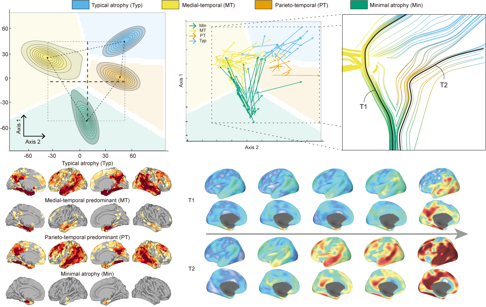
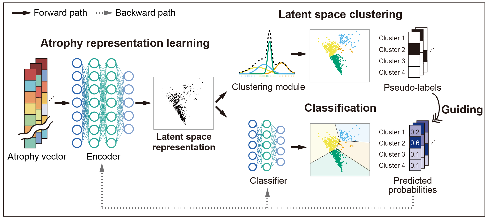

# DecoNet: Disentangling heterogeneity in latent space by self-supervised framework

This repository contains the code and data associated with the publication:

**[Disentangling brain atrophy heterogeneity in Alzheimer's disease: A deep self-supervised approach with interpretable latent space](https://doi.org/10.1016/j.neuroimage.2024.120737)**

Authors: Sohyun Kang, Sung-Woo Kim, Joon-Kyung Seong

Published in: *Neuroimage*, 2024



## Table of Contents

- [Introduction](#introduction)
- [Installation](#installation)
- [Usage](#usage)
- [Repository Structure](#repository-structure)
- [Citation](#citation)
- [License](#license)
- [Acknowledgments](#acknowledgments)
- [Contact](#contact)

## Introduction

### Overview

This repository contains the code for our deep self-supervised learning framework to disentangle heterogeneous features of brain atrophy in Alzheimer's Disease patients. Based on the clustering-based deep self-supervised learning framework by Caron et al. (2018), our method integrates atrophy feature extraction, clustering, and classification into an end-to-end learning process.

### Framework Steps

1. **Atrophy Representation Learning**:
   - An encoder compresses original atrophy vectors into latent representations.

2. **Latent Space Clustering**:
   - A clustering module groups these latent representations and assigns pseudo-labels.

3. **Classification**:
   - A classifier predicts the labels. By minimizing the cross-entropy loss between pseudo-labels and predicted probabilities, the encoder and classifier are refined, improving the latent representations.

### Benefits

- Simultaneous atrophy feature extraction, clustering, and classification.
- Effective disentanglement of disease heterogeneity into key dimensions, progreesion and subtypes, in the latent space.

## Installation

1. **Clone the repository**:

    ```bash
    git clone https://github.com/SohyunKang/DebaNet.git
    cd DebaNet
    ```

2. **Install the required packages**:

    ```bash
    pip install -r requirements.txt
    ```

## Usage

To run the main analysis:

```bash
python src/main_script.py
```

## Repository Structure
- `data/`: Data files
- `final/`: Final model
- `img/`: Project overview images
- `src/`: Source code
- `README.md`: Project documentation

## Citation
If you use this code or dataset in your research, please cite the following publication:

```scss
@article{kang2024disentangling,
  title={Disentangling brain atrophy heterogeneity in Alzheimer's disease: a deep self-supervised approach with interpretable latent space},
  author={Kang, Sohyun and Kim, Sung-Woo and Seong, Joon-Kyung and Alzheimer's Disease Neuroimaging Initiative and others},
  journal={NeuroImage},
  pages={120737},
  year={2024},
  publisher={Elsevier}
}
```

## License


## Acknowledgments
Funding sources
Collaborators
Contributors

## Contact
For questions or issues, please contact:

Sohyun Kang - fjqmfl5676@korea.ac.kr
